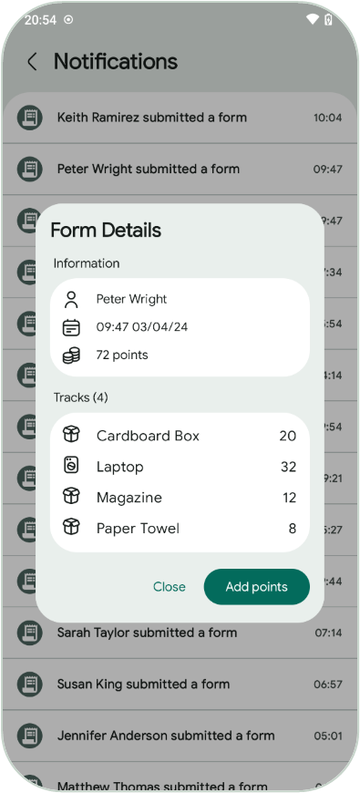

# 🌿 Greenify Me

  
  

## 📄 Description

Greenify Me is a mobile application designed to promote recycling and sustainability by incentivizing users to recycle various materials. This project is developed by the University of Macedonia as a school project based on a hypothetical scenario, aiming to enhance awareness and engagement in sustainability and resource conservation. The app allows users to earn rewards through a points-based system for properly disposing of recyclable items.

## ⚙️ How It Works

1. **Sign Up/Login:** Users create an account or log in to access the app.
2. **Record Recycling:** Users submit details of recycled materials through the submission form.
3. **Admin Approval:** Administrators review and approve the submitted records, allocating points for rewards.
4. **Earn Rewards:** Users accumulate points based on their recycling activities and redeem rewards accordingly.
